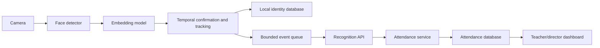

# School Attendance AI

School Attendance AI is a portfolio prototype that connects a local InsightFace/OpenCV
recognition client to a FastAPI school-attendance dashboard. It enrolls consented face
images into a local SQLite gallery, confirms identities across several frames, sends
`person_id`-keyed `ENTRY` or `EXIT` events, and maintains daily attendance records.
It is not biometric authentication software and has no liveness detection.

**Status:** portfolio prototype. The automated suite is hardware-independent; live
camera accuracy, fairness, spoof resistance, and school deployment have not been validated.

**Includes:** local face enrollment and recognition, a bounded recognition-event queue,
idempotent attendance updates, director/teacher dashboard roles, manual corrections, and
synthetic demo data.

**Start here:** [architecture](docs/architecture.md) · [setup](#installation) ·
[synthetic demo](#initialize-the-database-and-synthetic-data) ·
[screenshot and demo checklist](docs/assets/README.md)

## Problem and scope

The project explores a practical school workflow: repeated webcam detections should not
create repeated or alternating attendance changes, names may not be unique, and the web
application must remain usable when the camera/model process runs separately. The design
therefore uses immutable `person_id` values, bounded background work, temporal
confirmation, API idempotency, explicit camera direction, and an auditable manual
correction path.

## Main features

- Local InsightFace detection/embedding inference with CPU or CUDA ONNX Runtime.
- Normalized cosine matching against a local, multi-template-capable SQLite gallery.
- Lightweight temporal confirmation and per-face tracking with miss tolerance.
- Camera reconnect handling, bounded event queue, optional ignored snapshots, and API retry.
- FastAPI/Jinja dashboard with director and teacher roles, Argon2id passwords, CSRF tokens,
  secure cookie controls, login throttling, trusted hosts, and server-side authorization.
- Stable `person_id` values, duplicate-name support, explicit `ENTRY`/`EXIT` events, cooldown, and
  idempotent recognition ingestion.
- Validated CSV roster imports, UTC persistence, Asia/Tashkent display, migration scripts,
  synthetic sample data, tests, CI, and backend Docker support.

## Architecture



The detector and embedding model are local. Only a confirmed stable ID, display metadata,
similarity, timestamp, event type, source, and UUID are sent to the backend. The recognition
gallery and backend database remain separate by design. See
[`docs/architecture.md`](docs/architecture.md) and the
[SVG architecture asset](docs/assets/architecture.svg).

## Recognition-to-attendance flow

1. Enrollment reads `person.json` plus consented images and stores a representative,
   normalized embedding under `person_id`.
2. Live recognition detects faces and compares normalized embeddings with cosine similarity.
3. A track must meet the configured similarity and consecutive-hit thresholds.
4. The client submits one UUID-keyed `ENTRY` or `EXIT` recognition event through the bounded
   queue.
5. The backend rechecks similarity, `person_id`, event age, idempotency, and cooldown.
6. The first valid `ENTRY` records arrival as present/late; repeated entries do not make the
   person absent. `EXIT` records departure and does not alter present/late status.
7. A director may correct a record; actor, previous status, new status, reason, and time are
   retained in the audit table.

## Screenshots and demo

Screenshots and a demo video are not published yet. Before adding them, capture the dashboard
with synthetic records and use either a consenting adult or a clearly synthetic illustration
for the recognition view. Follow the review checklist in
[`docs/assets/README.md`](docs/assets/README.md).

## Technology stack

Python 3.11, FastAPI, Jinja2, SQLAlchemy, SQLite, Argon2id, Pydantic Settings,
InsightFace, ONNX Runtime, OpenCV, NumPy, Requests, pytest, Ruff, mypy, Docker, and GitHub
Actions.

## Repository structure

```text
backend/                 FastAPI app, templates, static assets, migrations, scripts, tests
recognition/             local CV client, enrollment, tracking, evaluation, tests
docs/                    architecture, API, deployment, privacy/security, evaluation
sample_data/             synthetic roster and metadata templates
scripts/                 Windows-friendly setup, quality, and safe cleanup helpers
.github/                 CI, issue forms, and pull-request template
.env.example             safe configuration template
docker-compose.yml       optional backend container
pyproject.toml           dependencies and quality-tool configuration
```

Runtime databases, models, face images, embeddings, snapshots, evaluation inputs, secrets,
and virtual environments are intentionally ignored.

## Requirements

- Python 3.11 (64-bit recommended).
- A webcam only for live recognition; tests need no camera or model download.
- Backend-only use does not require InsightFace, OpenCV, ONNX Runtime, or a GPU.
- Recognition requires a separately obtained InsightFace-compatible model pack. The bundled
  `buffalo_l` weights are not redistributed by this repository.

## Installation

Windows PowerShell:

```powershell
py -3.11 -m venv .venv
.\.venv\Scripts\Activate.ps1
python -m pip install "pip>=26.1.2"
python -m pip install -e ".[dev]"
# Recognition workstation only:
python -m pip install -e ".[recognition]"
Copy-Item .env.example .env
```

The equivalent scripted setup is
`powershell -NoProfile -ExecutionPolicy Bypass -File scripts\bootstrap.ps1 -SyntheticData`.
If the Python launcher is unavailable, add `-BasePython C:\path\to\python.exe`.

Linux/macOS:

```bash
python3.11 -m venv .venv
source .venv/bin/activate
python -m pip install 'pip>=26.1.2'
python -m pip install -e '.[dev]'
# Recognition workstation only:
python -m pip install -e '.[recognition]'
cp .env.example .env
```

## Environment configuration

Edit `.env` locally. At minimum, generate independent random values for
`ATTENDANCE_SESSION_SECRET` and `ATTENDANCE_API_INGEST_KEY`, copy the ingest key to
`RECOGNITION_API_KEY`, and enable both API flags only when using the integration.

```powershell
python -c "import secrets; print(secrets.token_urlsafe(48))"
```

Production validates required secrets, HTTPS for the recognition client, secure cookies,
debug mode, and trusted hosts. It refuses known placeholder secrets. All settings and
thresholds are listed in [`.env.example`](.env.example).

## Initialize the database and synthetic data

```powershell
python -m backend.scripts.setup_demo
```

This creates `.env` when needed, generates local secrets, initializes SQLite, imports the
synthetic roster, and creates synthetic director and teacher accounts. New credentials are
printed once; rerunning the command never changes or reprints existing passwords. It refuses
production mode or a database containing non-demo people/accounts. To remove only `DEMO-*`
records and `demo.*` accounts without deleting the database file, run
`python -m backend.scripts.reset_demo_data`.

## Run the backend

```powershell
python -m uvicorn backend.main:app --host 127.0.0.1 --port 8000 --reload
```

Open <http://127.0.0.1:8000/login>. For Docker, see
[`docs/deployment.md`](docs/deployment.md).
The unauthenticated readiness endpoint is <http://127.0.0.1:8000/healthz>.

## Enrollment

Create a private ignored directory such as:

```text
recognition/data/known_faces/demo-student-001/
  person.json
  image-01.jpg
  image-02.jpg
```

Copy [`sample_data/person.example.json`](sample_data/person.example.json), use the exact
roster `person_id`, obtain consent, and then run:

```powershell
python -m recognition.main --mode enroll
```

The current enrollment path averages usable normalized embeddings for compatibility. The
gallery schema supports multiple templates per stable ID for future evaluated strategies.

## Live recognition

```powershell
python -m recognition.main --mode self-check
python -m recognition.main --mode webcam --camera-index 0
```

Set `RECOGNITION_CAMERA_MODE=ENTRY` for an arrival camera or `EXIT` for a departure camera.
Do not use one ambiguous camera to infer direction from recognition count.

## Tests and quality checks

```powershell
python -m pytest
python -m ruff check .
python -m ruff format --check .
python -m mypy backend recognition
python -m pip check
python -m pip_audit --skip-editable
```

Tests mock model/camera boundaries and require no private data, model download, webcam, GPU,
or backend secret.

## API overview

`POST /api/recognition-event` requires `X-API-Key`; the optional `Idempotency-Key` must equal
the payload UUID. The API accepts `person_id` values and explicit `ENTRY`/`EXIT` values only.
Interactive routes use signed sessions and role checks. See [`docs/api.md`](docs/api.md).

## Attendance state machine

`ENTRY`, `EXIT`, duplicate UUIDs, cooldown observations, low-confidence matches, and manual
corrections have explicit outcomes. `EXIT` before arrival is a recorded no-op; repeated
recognition never toggles a person to absent. The complete transition table and local-day
rules are in [`docs/attendance-state-machine.md`](docs/attendance-state-machine.md).

## Docker

The backend can run in a non-root container; the webcam client remains local:

```powershell
python -m backend.scripts.setup_demo
docker compose config
docker compose run --rm backend python -m backend.scripts.setup_demo
docker compose up --build
```

Compose binds to localhost, persists the backend database in a named volume, and checks
`/healthz`. Production requires an HTTPS public base URL, exact hosts, secure cookies, and
fresh secrets. See [`docs/deployment.md`](docs/deployment.md).

## Privacy, security, and limitations

Face embeddings and attendance records are sensitive. Use explicit consent, collect the
minimum data, restrict access, define retention/deletion procedures, and provide a manual
correction/appeal path. Never use this project for covert surveillance or high-security
authentication. Applicable law and school policy must be reviewed by a qualified local
party; this documentation is not legal advice. See
[`docs/security-and-privacy.md`](docs/security-and-privacy.md) and [`SECURITY.md`](SECURITY.md).

There is no liveness or presentation-attack detection. A printed photograph, phone screen,
or replayed video may fool the model. Similarity thresholds are configuration values, not
accuracy guarantees. Performance and error rates can vary with camera, lighting, pose,
occlusion, age, and demographic group.

## Evaluation status

No project-specific accuracy, fairness, latency, or FPS results are published yet. The
repository includes a score-based evaluation command but intentionally contains no real
face dataset or fabricated benchmark. See
[`docs/recognition-evaluation.md`](docs/recognition-evaluation.md).

## Licensing

Project source code is Apache-2.0. InsightFace library code has its own license, while its
provided pretrained models—including `buffalo_l`—have separate usage restrictions and are
not covered by this repository’s license. Review current upstream terms and obtain an
appropriate model license before deployment. See [`LICENSE`](LICENSE) and
[`THIRD_PARTY_NOTICES.md`](THIRD_PARTY_NOTICES.md).

## Roadmap

- Collect consent-based threshold, subgroup, latency, and hardware measurements.
- Evaluate multi-template enrollment instead of assuming it improves results.
- Add an effective, independently evaluated liveness component before any security use.
- Add scoped teacher workflows and a visible manual-correction form.
- Consider a managed database and distributed rate limiter only if deployment requires them.

## Contributing, author, and security contact

See [`CONTRIBUTING.md`](CONTRIBUTING.md).

The author name, public project URL, and private security-reporting route still need to be
supplied by the repository owner before publication. Add the security route to
[`SECURITY.md`](SECURITY.md) after enabling it.
