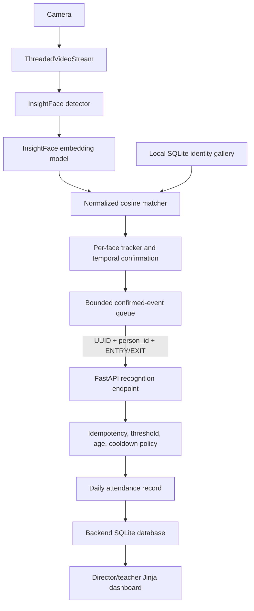

# Architecture

## Components

The recognition process and web platform are separate applications because camera/model
dependencies and dashboard/database dependencies have different operational needs. The
recognition client can keep working locally during transient API failure; attendance remains
the backend’s source of truth.

## Design choices

- `person_id` is separate from `display_name` because names can change or be duplicated in
  the roster and gallery.
- Temporal confirmation exists because a single noisy frame should not immediately create
  attendance. Webcam mode disables the older left-to-right smoother and uses per-face tracks.
- The event queue is bounded so a slow API or disk cannot create unbounded webcam memory use.
  A full queue drops a side effect and logs it; the recognition loop remains responsive.
- The client and backend both enforce cooldown. Client cooldown reduces traffic; backend
  cooldown is authoritative and survives different clients.
- Recognition-event UUIDs make retries idempotent. `ENTRY` and `EXIT` are explicit; count
  parity is never used to set attendance.
- Snapshots are optional and off by default because they substantially increase privacy risk.
- SQLite is retained for a local prototype. WAL, busy timeout, foreign keys, constraints, and
  transactions improve reliability without pretending it is a multi-region database.

## Failure behavior

- Camera/stream reads use configured retry and reconnect thresholds. File sources end rather
  than reconnect.
- Model initialization fails with an actionable error if runtime/model files are unavailable.
- API requests have finite timeouts and retries. A failed request is logged and not marked sent.
- Duplicate API UUIDs return the original attendance result without applying another change.
- Existing version-1 databases are never silently destroyed; copy-based migration scripts are
  provided for backend and gallery schemas.

## Known incomplete areas

Teacher routes currently show a minimal protected page. Manual corrections have an audited
service and endpoint but no dedicated form. No distributed login limiter, liveness detector,
real benchmark, or retention scheduler is implemented.
