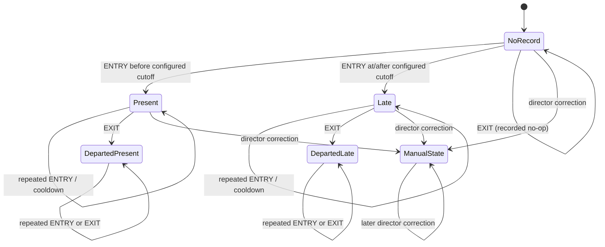

# Attendance state machine

Attendance is a daily record keyed by `(person_type, person_id, local_date)`. Recognition
events are immutable observations; they do not toggle a Boolean attendance flag. Event times
are accepted only with an explicit UTC offset, persisted in UTC, and assigned to an attendance
day in `Asia/Tashkent`.

## Rules

- `ENTRY` creates at most one arrival for the local attendance day. Before the configured
  cutoff it is `present`; at or after the cutoff it is `late`.
- A repeated event UUID returns the original result as `duplicate`. A different UUID for the
  same person, direction, and camera during cooldown is stored with outcome `cooldown`.
- A later `ENTRY` cannot make a person absent and cannot overwrite an audited manual decision.
- `EXIT` never follows from recognition count. Before an arrival it is an auditable `recorded`
  no-op; after an arrival it sets departure once and leaves the present/late status unchanged.
- Similarity below the backend threshold is `rejected`. An unknown stable ID is `unmatched`.
  Neither case creates attendance.
- Manual correction requires a director session, a CSRF token, a reason, and a stable ID. The
  actor, previous status, new status, reason, and time are stored. Setting `absent` clears
  incompatible arrival and departure values.
- Current recognition ingestion targets students. Worker attendance uses the same stable-ID
  daily record and manual-correction audit path; automated worker recognition is not exposed.

## Outcomes

`applied` changed attendance; `recorded` saved a valid observation without a transition;
`duplicate` reused an existing UUID; `cooldown` suppressed a near-duplicate transition;
`unmatched` found no stable roster identity; and `rejected` failed the similarity policy.
